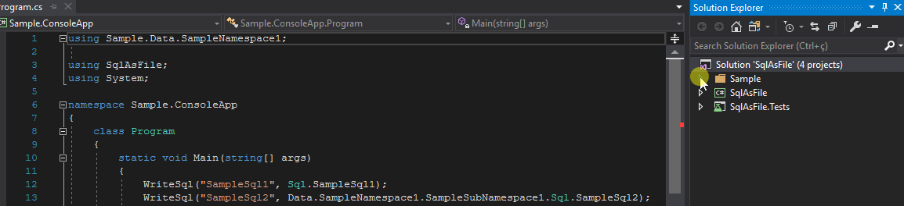

# SqlAsFile
Use your SQL in .sql files instead of strings in C#



> This project can be useful if you are working on a project with Dapper, ADO .NET or other data framework/library that uses raw SQL.

# Setup
* Install the `SqlAsfile` on your `Data` project (where your .sql files will be created).
```shell
install-package SqlAsFile
```
* Copy the [SqlInfoGenerator.tt](https://github.com/giacomelli/SqlAsFile/blob/master/src/Sample.Data/SqlInfoGenerator.tt) to your `Data` project.
	* Change the namespace of line bellow to the namespace of your `Data` project.
	```csharp
		var projectNamespace = "Sample.Data";
	``` 
* Add your .sql files inside any folder os subfolder of your `Data` project.
> The `Build Action` property of the .sql files should be changed to `Embedded Resource`.
* Run the `SqlInfoGenerator.tt` (right click, `Run Custom Tool`)

# Usage
Now you can access the content of your .sql files in a strongly typed way directly from your C# code:

```
// Using the SQL inside of the file SampleSql2.sql on the folder  SampleData\Data\SampleNamespace1\SampleSubNamespace1.
var sql = SampleData.Data.SampleNamespace1.SampleSubNamespace1.Sql.SampleSql2
``` 

# Tags
You can use some tags to tell to SqlAsFile's parser how to treat a portion of the file:

### test-args
Anything inside of these tags will be strip off of the SQL that you can access on C#.
> This tag is useful when you want to test the .sql directly against the DB without need to define the arguments every time.

```sql
--<test-args>
DECLARE @name VARCHAR(100) = 'test';
DECLARE @surname VARCHAR(200) = NULL;
--</test-args>
```

### cte
Use this tag if you want to read the CTE of your file in the `Cte` property on C#.

```sql
--<cte>
WITH LastMessages(ContactId, Id, NotRead)
AS (	
)
--</cte>
```
